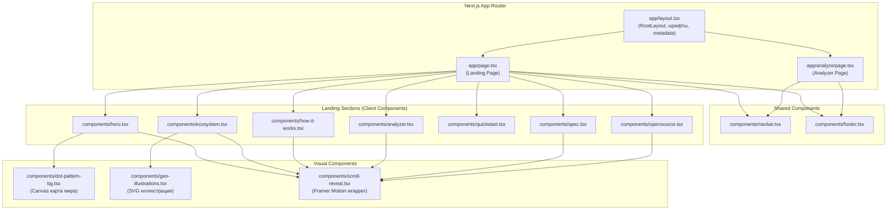

# Design Document: GEO AI Landing

## Overview

Дизайн описывает архитектуру и реализацию landing-сайта GEO AI — современного, минималистичного сайта для open-source dev-tool проекта. Сайт построен на Next.js 16 (App Router), React 19, Tailwind CSS 4 с использованием Shadcn UI, Lucide Icons, Framer Motion и Canvas/SVG для визуальных элементов.

Сайт состоит из главной landing page (`/`) с последовательными секциями и отдельной страницы анализатора (`/analyze`). Визуальный стиль — чистый, минималистичный, с обильным whitespace, абстрактными dot-pattern фонами и геометрическими SVG/Canvas иллюстрациями. Основная тема — светлая, с поддержкой dark mode через `prefers-color-scheme`.

Ключевые технические решения:
- Server Components по умолчанию, Client Components только для интерактивных элементов (анимации, формы, Canvas)
- Framer Motion для scroll reveal и hover анимаций
- Canvas API для dot-pattern карты мира в Hero
- SVG для геометрических иллюстраций на карточках
- CSS custom properties для Theme System
- Intersection Observer (через Framer Motion `whileInView`) для scroll-triggered анимаций

## Architecture

### Общая архитектура



### Решения по архитектуре

1. **Server vs Client Components**: `app/page.tsx` — Server Component, импортирующий Client Components для секций. Это обеспечивает SSR для SEO и hydration для интерактивности.
2. **Компонентная декомпозиция**: Каждая секция — отдельный Client Component с `"use client"` директивой (необходимо для Framer Motion).
3. **Анимации**: Единый подход через Framer Motion `motion` компоненты с `whileInView` для scroll reveal, `whileHover` для hover эффектов. Компонент `ScrollReveal` — переиспользуемый wrapper.
4. **Canvas для dot-pattern**: Отдельный Client Component с `useEffect` для рендеринга на Canvas. Точки формируют абстрактную карту мира с subtle анимацией движения.
5. **SVG иллюстрации**: Статические SVG компоненты для геометрических иллюстраций на карточках экосистемы. Три варианта: кольца, радиальный burst, параллельные линии.
6. **Theme System**: CSS custom properties в `globals.css` с `@media (prefers-color-scheme: dark)`. Tailwind CSS 4 `dark:` variant для компонентов.


## Components and Interfaces

### Файловая структура

```
app/
├── layout.tsx              # RootLayout: шрифты Geist, metadata, ThemeProvider
├── page.tsx                # Landing page (Server Component, композиция секций)
├── analyze/
│   └── page.tsx            # Analyzer page
├── globals.css             # CSS variables, theme, base styles
components/
├── navbar.tsx              # Navigation bar (Client Component)
├── hero.tsx                # Hero section с CTA и AI logos bar
├── ecosystem.tsx           # Platform Ecosystem cards
├── how-it-works.tsx        # 4-step process
├── analyzer.tsx            # Analyzer demo section
├── quickstart.tsx          # Developer code block
├── spec.tsx                # GEO Specification section
├── opensource.tsx           # Open Source repos section
├── footer.tsx              # Footer
├── dot-pattern-bg.tsx      # Canvas dot-pattern карта мира
├── geo-illustrations.tsx   # SVG геометрические иллюстрации
├── scroll-reveal.tsx       # Framer Motion scroll reveal wrapper
└── ui/                     # Shadcn UI components (button, input, card, etc.)
```

### Интерфейсы компонентов

#### `ScrollReveal`
```typescript
// components/scroll-reveal.tsx
"use client";
interface ScrollRevealProps {
  children: React.ReactNode;
  className?: string;
  delay?: number;        // задержка анимации в секундах (default: 0)
  direction?: "up" | "down" | "left" | "right"; // направление slide (default: "up")
}
// Использует motion.div с whileInView, viewport={{ once: true }}
```

#### `DotPatternBackground`
```typescript
// components/dot-pattern-bg.tsx
"use client";
interface DotPatternBackgroundProps {
  className?: string;
  dotColor?: string;     // цвет точек (default: "rgba(0,0,0,0.15)")
  animated?: boolean;    // включить subtle движение (default: true)
}
// Canvas-компонент, рендерит точки по координатам карты мира
// Использует useEffect + requestAnimationFrame для анимации
// Проверяет prefers-reduced-motion для отключения анимации
```

#### `GeoIllustration`
```typescript
// components/geo-illustrations.tsx
type IllustrationType = "rings" | "radial-burst" | "parallel-lines";
interface GeoIllustrationProps {
  type: IllustrationType;
  className?: string;
}
// SVG-компонент, рендерит одну из трёх геометрических иллюстраций
```

#### `Navbar`
```typescript
// components/navbar.tsx
"use client";
// Фиксированная навигационная панель
// Содержит: логотип GEO AI, ссылки (Analyzer, GitHub, Documentation, Specification), кнопка Sign in
// sticky top-0 с backdrop-blur при прокрутке
```

#### `Hero`
```typescript
// components/hero.tsx
"use client";
// Полноэкранная секция (h-screen)
// Содержит: DotPatternBackground, надзаголовок, заголовок "GEO AI", подзаголовок, CTA кнопки, AI logos bar
// Анимации: fade-in заголовка, slide-up контента
```

#### `Ecosystem`
```typescript
// components/ecosystem.tsx
"use client";
// Три карточки продуктов с GeoIllustration
// Grid layout: заголовок секции + 3 карточки
// Hover эффект: subtle shadow lift
```

#### `HowItWorks`
```typescript
// components/how-it-works.tsx
"use client";
// 4 шага с иконками и connection lines
// Последовательная scroll reveal анимация с stagger
```

#### `Analyzer`
```typescript
// components/analyzer.tsx
"use client";
// Демо анализатора: input URL, кнопка, пример результатов
// Анимированный score gauge (SVG circle), progress bars
// Кнопка "Fix with GEO AI"
```

#### `QuickStart`
```typescript
// components/quickstart.tsx
"use client";
// Блок кода с syntax highlighting (CSS-based)
// Кнопка копирования в буфер обмена (navigator.clipboard API)
// Geist Mono шрифт для кода
```

#### `Spec`
```typescript
// components/spec.tsx
"use client";
// 4 элемента спецификации: llms.txt, AI metadata, crawler rules, structured signals
// Scroll reveal анимация
```

#### `OpenSource`
```typescript
// components/opensource.tsx
"use client";
// Карточки репозиториев со ссылками на GitHub и npm
// Отображение stars и downloads (статические значения)
```

#### `Footer`
```typescript
// components/footer.tsx
// Минимальный футер: название, ссылки, домен geoai.run
```

### Страница Analyzer (`/analyze`)

```typescript
// app/analyze/page.tsx
// Отдельная страница с формой ввода URL и результатами анализа
// Использует тот же визуальный стиль (Navbar, Footer, theme)
// Client Component для интерактивности формы
```


## Data Models

Проект является frontend-only landing page без backend API и базы данных. Данные представлены как статические константы в компонентах.

### Статические данные

#### Навигационные ссылки
```typescript
interface NavLink {
  label: string;
  href: string;
  external?: boolean; // открывать в новой вкладке
}

const NAV_LINKS: NavLink[] = [
  { label: "Analyzer", href: "/analyze" },
  { label: "GitHub", href: "https://github.com/madeburo/GEO-AI", external: true },
  { label: "Documentation", href: "#", external: true },
  { label: "Specification", href: "#spec" },
];
```

#### Продукты экосистемы
```typescript
interface EcosystemProduct {
  title: string;
  description: string;
  href: string;
  illustration: IllustrationType; // "rings" | "radial-burst" | "parallel-lines"
}

const ECOSYSTEM_PRODUCTS: EcosystemProduct[] = [
  {
    title: "GEO AI Core",
    description: "TypeScript engine for AI search optimization",
    href: "https://github.com/madeburo/GEO-AI",
    illustration: "rings",
  },
  {
    title: "GEO AI Woo",
    description: "WordPress & WooCommerce plugin",
    href: "https://github.com/madeburo/GEO-AI-Woo",
    illustration: "radial-burst",
  },
  {
    title: "GEO AI Shopify",
    description: "Shopify app for AI visibility",
    href: "https://github.com/madeburo/GEO-AI-Shopify",
    illustration: "parallel-lines",
  },
];
```

#### Шаги How It Works
```typescript
interface Step {
  icon: string;       // Lucide icon name
  title: string;
  description: string;
}

const STEPS: Step[] = [
  { icon: "FileText", title: "Generate llms.txt", description: "..." },
  { icon: "Shield", title: "Configure AI crawler rules", description: "..." },
  { icon: "Tags", title: "Add AI metadata", description: "..." },
  { icon: "Zap", title: "Provide structured signals", description: "..." },
];
```

#### AI логотипы
```typescript
interface AILogo {
  name: string;
  icon?: string; // путь к SVG или Lucide icon
}

const AI_LOGOS: AILogo[] = [
  { name: "ChatGPT" },
  { name: "Claude" },
  { name: "Gemini" },
  { name: "Perplexity" },
  { name: "Grok" },
  { name: "Qwen" },
];
```

#### Результаты анализатора (демо)
```typescript
interface AnalyzerResult {
  score: number;
  passed: string[];
  missing: string[];
}

const DEMO_RESULT: AnalyzerResult = {
  score: 72,
  passed: ["llms.txt detected", "AI metadata present", "structured schema"],
  missing: ["crawler rules missing", "AI summary missing"],
};
```

#### Элементы спецификации
```typescript
interface SpecItem {
  title: string;
  description: string;
  icon: string;
}

const SPEC_ITEMS: SpecItem[] = [
  { title: "llms.txt", description: "...", icon: "FileText" },
  { title: "AI metadata", description: "...", icon: "Tags" },
  { title: "Crawler rules", description: "...", icon: "Shield" },
  { title: "Structured signals", description: "...", icon: "Zap" },
];
```

#### Open Source репозитории
```typescript
interface Repository {
  name: string;
  href: string;
  stars: number;
  npmDownloads?: number;
  npmPackage?: string;
}

const REPOSITORIES: Repository[] = [
  { name: "GEO AI Core", href: "https://github.com/madeburo/GEO-AI", stars: 0, npmPackage: "geo-ai-core", npmDownloads: 0 },
  { name: "GEO AI Woo", href: "https://github.com/madeburo/GEO-AI-Woo", stars: 0 },
  { name: "GEO AI Shopify", href: "https://github.com/madeburo/GEO-AI-Shopify", stars: 0 },
];
```

### Координаты карты мира (Dot Pattern)

Координаты точек для Canvas dot-pattern хранятся как массив `[x, y]` пар, нормализованных в диапазоне `[0, 1]`. При рендеринге масштабируются под размер Canvas. Данные генерируются из упрощённого контура континентов (примерно 200-400 точек).

```typescript
// components/dot-pattern-bg.tsx
const WORLD_MAP_DOTS: [number, number][] = [
  // Нормализованные координаты точек континентов
  // [x: 0..1, y: 0..1]
  ...
];
```


## Correctness Properties

*A property is a characteristic or behavior that should hold true across all valid executions of a system — essentially, a formal statement about what the system should do. Properties serve as the bridge between human-readable specifications and machine-verifiable correctness guarantees.*

### Property 1: Навигационные ссылки присутствуют в Navbar

*For any* required navigation link (Analyzer, GitHub, Documentation, Specification), the rendered Navbar component should contain a link element with the correct label and href.

**Validates: Requirements 3.3**

### Property 2: AI логотипы отображаются в Hero

*For any* AI system name in the AI_LOGOS data (ChatGPT, Claude, Gemini, Perplexity, Grok, Qwen), the rendered AI Logos Bar should contain that name.

**Validates: Requirements 4.10**

### Property 3: Карточки экосистемы содержат все обязательные элементы

*For any* ecosystem product in the ECOSYSTEM_PRODUCTS data, the rendered card should contain: a GeoIllustration component, the product title, the product description, and a "Read more →" link with the correct href.

**Validates: Requirements 5.2, 5.5**

### Property 4: Уникальность иллюстраций на карточках экосистемы

*For any* pair of ecosystem products, their illustration types should be different (no two cards share the same illustration type).

**Validates: Requirements 5.3, 15.3**

### Property 5: Шаги How It Works отображаются полностью

*For any* step in the STEPS data, the rendered How It Works section should contain the step's title and an associated icon.

**Validates: Requirements 6.1**

### Property 6: Результаты анализатора отображают все данные

*For any* item in DEMO_RESULT.passed and DEMO_RESULT.missing, the rendered Analyzer section should display that item in the appropriate list (passed or missing).

**Validates: Requirements 7.3**

### Property 7: Копирование кода в буфер обмена

*For any* code block content in the QuickStart section, clicking the copy button should invoke navigator.clipboard.writeText with exactly that content.

**Validates: Requirements 8.5**

### Property 8: Элементы спецификации отображаются полностью

*For any* spec item in the SPEC_ITEMS data (llms.txt, AI metadata, crawler rules, structured signals), the rendered Specification section should contain that item's title.

**Validates: Requirements 9.2**

### Property 9: Карточки репозиториев содержат все обязательные данные

*For any* repository in the REPOSITORIES data, the rendered Open Source section should display the repository name as a link with the correct href, the GitHub stars count, and (if applicable) the npm downloads count.

**Validates: Requirements 10.1, 10.2**

### Property 10: Ссылки Footer содержат все обязательные элементы

*For any* required footer link (Analyzer, GitHub, Documentation, Specification), the rendered Footer should contain a link element with the correct label and href.

**Validates: Requirements 11.2**

### Property 11: Семантическая HTML-разметка

*For any* major section of the landing page (navigation, main content, individual sections, footer), the rendered HTML should use the appropriate semantic element (nav, main, section, footer respectively).

**Validates: Requirements 13.3**

### Property 12: Анимации используют только GPU-ускоренные свойства

*For any* Framer Motion animation configuration in the codebase, the animated properties should be limited to transform-related properties (x, y, scale, rotate) and opacity.

**Validates: Requirements 12.2**


## Error Handling

Проект является статическим frontend landing page без API-вызовов, поэтому error handling минимален.

### Обработка ошибок по компонентам

| Компонент | Возможная ошибка | Обработка |
|-----------|-----------------|-----------|
| `DotPatternBackground` | Canvas API недоступен (SSR, старый браузер) | Проверка `typeof window !== 'undefined'` и наличия Canvas API. Fallback: не рендерить Canvas, показать пустой фон |
| `QuickStart` (копирование) | `navigator.clipboard` недоступен (HTTP, старый браузер) | Try/catch, fallback на `document.execCommand('copy')` или показ toast с ошибкой |
| `ScrollReveal` / Framer Motion | Framer Motion не загрузился | Компоненты рендерятся без анимации (graceful degradation) |
| `GeoIllustration` | Невалидный `type` prop | TypeScript enum ограничивает допустимые значения. Default case в switch возвращает null |
| Analyzer Page (`/analyze`) | Невалидный URL в поле ввода | Клиентская валидация URL формата перед отправкой. Показ inline error message |
| Общее | JavaScript отключён | SSR обеспечивает рендеринг контента. Анимации и интерактивность недоступны, но контент читаем |

### Стратегия prefers-reduced-motion

```typescript
// Проверка в каждом анимированном компоненте
const prefersReducedMotion = 
  typeof window !== 'undefined' && 
  window.matchMedia('(prefers-reduced-motion: reduce)').matches;

// Framer Motion: использовать пустые variants при reduced motion
const variants = prefersReducedMotion 
  ? {} 
  : { hidden: { opacity: 0, y: 20 }, visible: { opacity: 1, y: 0 } };
```

## Testing Strategy

### Подход к тестированию

Используется двойной подход: unit-тесты для конкретных примеров и edge cases, property-based тесты для универсальных свойств.

### Инструменты

- **Unit/Integration тесты**: Vitest + React Testing Library (`@testing-library/react`)
- **Property-based тесты**: `fast-check` (библиотека для property-based testing в TypeScript/JavaScript)
- **Конфигурация PBT**: минимум 100 итераций на каждый property test

### Unit тесты (примеры и edge cases)

Фокус на конкретных примерах, интеграционных точках и edge cases:

1. **Секции в правильном порядке** (Req 1.1): Проверить DOM-порядок секций на landing page
2. **Metadata корректна** (Req 13.1, 13.2, 13.4): Проверить title, description, OG tags
3. **Hero содержит ключевые элементы** (Req 4.5-4.9): Проверить надзаголовок, заголовок, подзаголовок, CTA кнопки
4. **Analyzer section UI** (Req 7.1, 7.2, 7.5): Проверить заголовок, input, кнопки
5. **QuickStart code blocks** (Req 8.1, 8.2, 8.4): Проверить наличие install команды, примера кода, кнопки копирования
6. **Footer содержимое** (Req 11.1, 11.3): Проверить название, домен
7. **Analyzer page рендерится** (Req 14.1, 14.2, 14.3): Проверить /analyze route
8. **Theme CSS variables** (Req 2.1, 2.3, 2.4): Проверить значения CSS custom properties для light/dark
9. **Navbar sticky positioning** (Req 3.6): Проверить CSS класс sticky/fixed
10. **prefers-reduced-motion** (Req 12.6): Проверить отключение анимаций

### Property-based тесты

Каждый property test ссылается на соответствующее свойство из раздела Correctness Properties. Минимум 100 итераций.

Формат тега: `Feature: geo-ai-landing, Property {number}: {property_text}`

1. **Property 1**: Генерировать случайные подмножества NAV_LINKS, проверять что все ссылки рендерятся в Navbar
2. **Property 2**: Генерировать случайные подмножества AI_LOGOS, проверять что все имена отображаются
3. **Property 3**: Генерировать случайные EcosystemProduct объекты, проверять что карточка содержит все обязательные элементы
4. **Property 4**: Генерировать случайные массивы EcosystemProduct, проверять уникальность illustration types
5. **Property 5**: Генерировать случайные Step объекты, проверять что все шаги рендерятся
6. **Property 6**: Генерировать случайные AnalyzerResult объекты с произвольными passed/missing списками, проверять что все элементы отображаются
7. **Property 7**: Генерировать случайные строки кода, проверять что clipboard.writeText вызывается с правильным содержимым
8. **Property 8**: Генерировать случайные SpecItem объекты, проверять что все titles отображаются
9. **Property 9**: Генерировать случайные Repository объекты, проверять что все данные (name, href, stars, downloads) отображаются
10. **Property 10**: Генерировать случайные подмножества footer links, проверять что все ссылки рендерятся
11. **Property 11**: Рендерить landing page, проверять что каждая секция использует семантический HTML элемент
12. **Property 12**: Генерировать случайные animation config объекты, проверять что анимируются только transform/opacity свойства

